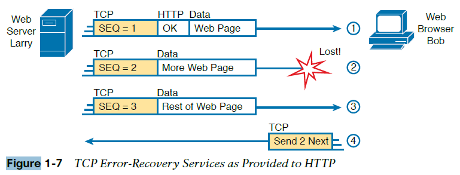
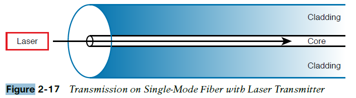
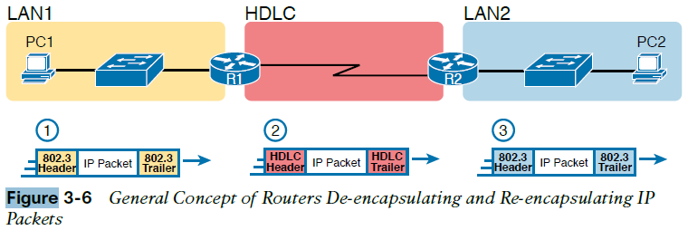
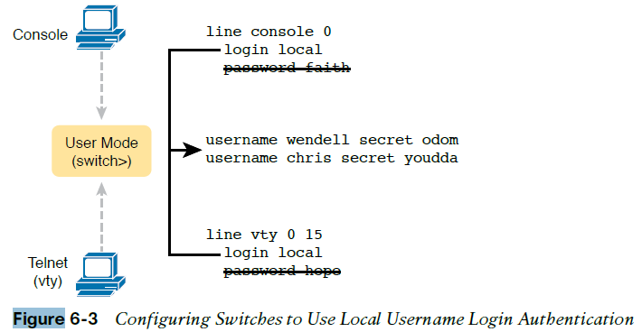
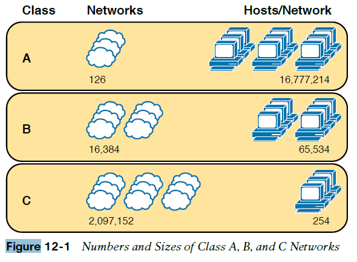
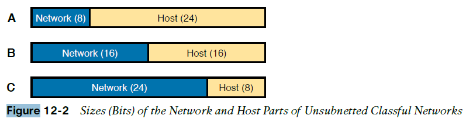
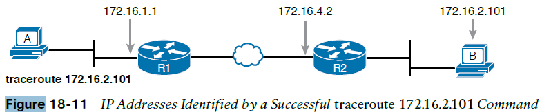
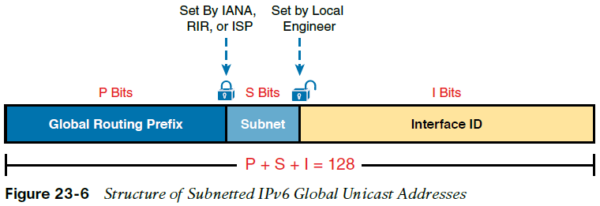
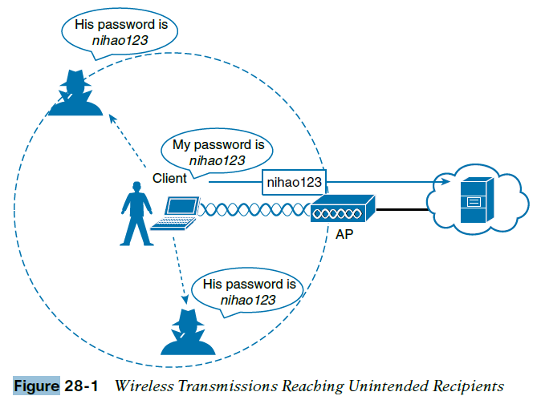
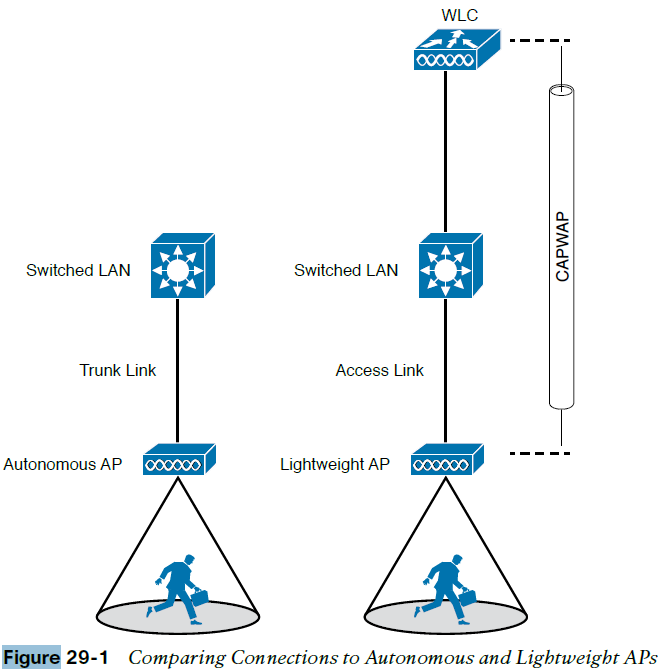

###### fig-01-01

###### fig-01-02

###### fig-01-03

###### fig-01-04

###### fig-01-05

###### fig-01-06

###### fig-01-07

###### fig-01-08

###### fig-01-09

###### fig-01-10

###### fig-01-11

###### fig-01-12

###### fig-01-13

###### fig-01-14

###### fig-01-15

###### fig-02-01

###### fig-02-02

###### fig-02-03

###### fig-02-04

###### fig-02-05

###### fig-02-06

###### fig-02-07

###### fig-02-08

###### fig-02-09

###### fig-02-10

###### fig-02-11

###### fig-02-12

###### fig-02-13

###### fig-02-14

###### fig-02-15

###### fig-02-16

###### fig-02-17

###### fig-02-18

###### fig-02-19

###### fig-02-20

###### fig-02-21

###### fig-02-22

###### fig-02-23

###### fig-02-24

###### fig-03-01

###### fig-03-02

###### fig-03-03

###### fig-03-04

###### fig-03-05

###### fig-03-06

###### fig-03-07

###### fig-03-08

###### fig-03-09

###### fig-03-10

###### fig-03-11

###### fig-03-12

###### fig-03-13

###### fig-03-14

###### fig-03-15

###### fig-04-01

###### fig-04-02

###### fig-04-03

###### fig-04-04

###### fig-04-05

###### fig-04-06

###### fig-04-07

###### fig-04-08

###### fig-04-09

###### fig-05-01

###### fig-05-02

###### fig-05-03

###### fig-05-04

###### fig-05-05

###### fig-05-06

###### fig-05-07

###### fig-05-08

###### fig-05-09

###### fig-05-10

###### fig-06-01

###### fig-06-02

###### fig-06-03

###### fig-06-04

###### fig-06-05

###### fig-06-06

###### fig-06-07

###### fig-06-08

###### fig-07-01

###### fig-07-02

###### fig-07-03

###### fig-07-04

###### fig-08-01

###### fig-08-02

###### fig-08-03

###### fig-08-04

###### fig-08-05

###### fig-08-06

###### fig-08-07

###### fig-08-08

###### fig-08-09

###### fig-08-10

###### fig-08-11

###### fig-08-12

###### fig-08-13

###### fig-08-14

###### fig-09-01

###### fig-09-02

###### fig-09-03

###### fig-09-04

###### fig-09-05

###### fig-09-06

###### fig-09-07

###### fig-09-08

###### fig-09-09

###### fig-09-10

###### fig-09-11

###### fig-09-12

###### fig-10-01

###### fig-10-02

###### fig-10-03

###### fig-10-04

###### fig-10-05

###### fig-10-06

###### fig-10-07

###### fig-10-08

###### fig-10-09

###### fig-10-10

###### fig-11-01

###### fig-11-02

###### fig-11-03

###### fig-11-04

###### fig-11-05

###### fig-11-06

###### fig-11-07

###### fig-11-08

###### fig-11-09

###### fig-11-10

###### fig-11-11

###### fig-11-12

###### fig-11-13

###### fig-11-14

###### fig-11-15

###### fig-11-16

###### fig-11-17

###### fig-11-18

###### fig-11-19

###### fig-11-20

###### fig-11-21

###### fig-11-22

###### fig-12-01

###### fig-12-02

###### fig-12-03

###### fig-12-04

###### fig-12-05

###### fig-13-01

###### fig-13-02

###### fig-13-03

###### fig-13-04

###### fig-13-05

###### fig-13-06

###### fig-13-07

###### fig-13-08

###### fig-13-09

###### fig-14-01

###### fig-14-02

###### fig-14-03

###### fig-14-04

###### fig-14-05

###### fig-14-06

###### fig-14-07

###### fig-14-08

###### fig-14-09

###### fig-14-10

###### fig-14-11

###### fig-14-12

###### fig-15-01

###### fig-15-02

###### fig-15-03

###### fig-15-04

###### fig-15-05

###### fig-15-06

###### fig-16-01

###### fig-16-02

###### fig-16-03

###### fig-16-04

###### fig-16-05

###### fig-16-06

###### fig-16-07

###### fig-16-08

###### fig-16-09

###### fig-16-10

###### fig-16-11

###### fig-16-12

###### fig-16-13

###### fig-16-14

###### fig-16-15

###### fig-17-01

###### fig-17-02

###### fig-17-03

###### fig-17-04

###### fig-17-05

###### fig-17-06

###### fig-17-07

###### fig-18-01

###### fig-18-02

###### fig-18-03

###### fig-18-04

###### fig-18-05

###### fig-18-06

###### fig-18-07

###### fig-18-08

###### fig-18-09

###### fig-18-10

###### fig-18-11

###### fig-18-12

###### fig-18-13

###### fig-18-14

###### fig-18-15

###### fig-19-01

###### fig-19-02

###### fig-19-03

###### fig-19-04

###### fig-19-05

###### fig-19-06

###### fig-19-07

###### fig-19-08

###### fig-19-09

###### fig-19-10

###### fig-19-11

###### fig-19-12

###### fig-19-13

###### fig-19-14

###### fig-19-15

###### fig-19-16

###### fig-19-17

###### fig-20-01

###### fig-20-02

###### fig-20-03

###### fig-20-04

###### fig-20-05

###### fig-20-06

###### fig-20-07

###### fig-21-01

###### fig-21-02

###### fig-21-03

###### fig-21-04

###### fig-21-05

###### fig-22-01

###### fig-22-02

###### fig-22-03

###### fig-22-04

###### fig-22-05

###### fig-22-06

###### fig-22-07

###### fig-23-01

###### fig-23-02

###### fig-23-03

###### fig-23-04

###### fig-23-05

###### fig-23-06

###### fig-23-07

###### fig-23-08

###### fig-23-09

###### fig-23-10

###### fig-23-11

###### fig-23-12

###### fig-24-01

###### fig-24-02

###### fig-24-03

###### fig-24-04

###### fig-24-05

###### fig-24-06

###### fig-24-07

###### fig-24-08

###### fig-24-09

###### fig-24-10

###### fig-24-11

###### fig-24-12

###### fig-24-13

###### fig-25-01

###### fig-25-02

###### fig-25-03

###### fig-25-04

###### fig-25-05

###### fig-25-06

###### fig-25-07

###### fig-25-08

###### fig-25-09

###### fig-25-10

###### fig-25-11

###### fig-26-01

###### fig-26-02

###### fig-26-03

###### fig-26-04

###### fig-26-05

###### fig-26-06

###### fig-26-07

###### fig-26-08

###### fig-26-09

###### fig-26-10

###### fig-26-11

###### fig-26-12

###### fig-26-13

###### fig-26-14

###### fig-26-15

###### fig-26-16

###### fig-26-17

###### fig-26-18

###### fig-26-19

###### fig-26-20

###### fig-26-21

###### fig-26-22

###### fig-27-01

###### fig-27-02

###### fig-27-03

###### fig-27-04

###### fig-27-05

###### fig-27-06

###### fig-27-07

###### fig-27-08

###### fig-27-09

###### fig-27-10

###### fig-27-11

###### fig-28-01

###### fig-28-02

###### fig-28-03

###### fig-28-04

###### fig-28-05

###### fig-28-06

###### fig-29-01

###### fig-29-02

###### fig-29-03

###### fig-29-04

###### fig-29-05

###### fig-29-06

###### fig-29-07

###### fig-29-08

###### fig-29-09

###### fig-29-10

###### fig-29-11

###### fig-29-12

###### fig-29-13

###### fig-29-14

###### fig-29-15

###### fig-29-16

###### fig-29-17

###### fig-29-18

###### fig-29-19

###### fig-29-20

###### fig-29-21